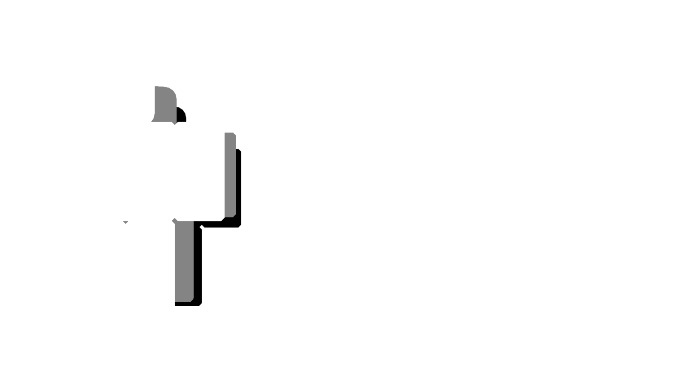

<p align="center">
  
</p>

> [!NOTE]
> This repository is a fork of [gitlab.com/centerepic/robloxmanager](https://gitlab.com/centerepic/robloxmanager).

A fast, lightweight Roblox account manager built with Rust and [egui](https://github.com/emilk/egui). Manage multiple Roblox accounts, launch games, and switch between sessions with ease.

> [!WARNING]
> This tool interacts with Roblox authentication cookies and game-launching internals. Use it at your own risk. The multi-instance feature bypasses Roblox's singleton mutex, which may conflict with Hyperion anti-cheat and could carry ban risk. This project is not affiliated with or endorsed by Roblox Corporation.

## Features

- **Multi-Account Management** - Add, remove, and organize Roblox accounts with cookie-based auth
- **Encrypted Storage** - AES-256-GCM, unlocked automatically via Windows Credential Manager. An optional master password (Argon2id) is available for anyone who wants one
- **Multi-Instance** - Launch multiple Roblox clients simultaneously
- **Bulk Launch** - Launch selected accounts into the same server sequentially
- **Privacy Mode** - Clears tracking cookies before each launch
- **Auto Window Tiling** - Arranges Roblox windows in a grid after launch
- **Live Presence** - Real-time Online / In Game / In Studio / Offline indicators

> [!IMPORTANT]
> RM stores Roblox authentication cookies in encrypted form. Never share your `.ROBLOSECURITY` cookie with anyone, and treat it like a password.

## Building from Source

### Prerequisites

- [Rust](https://rustup.rs/) (stable, 1.75+)
- Windows 10/11 (required for Win32 APIs)

### Build

```bash
# Clone the repository
git clone https://github.com/Paryx-games/roblox-manager.git
cd roblox-manager

# Build in release mode
cargo build --release

# Run
cargo run --release
````

The compiled binary will be at `target/release/ram_ui.exe`.

### Development

```powershell
# Check for errors without building
cargo check

# Run with debug logging (powershell, see below for bash)
$env:RUST_LOG="debug"; cargo run
```

Using bash / WSL / Git Bash:

```bash
RUST_LOG=debug cargo run
```

> [!TIP]
> If you are developing RM, `cargo check` is the quickest way to catch compilation errors without producing a release build.
> [!IMPORTANT]
> If you are planning to contribute, please read [the commit guide](CONVENTIONAL_COMMITS.md) and follow that structure. Your merge will be denied otherwise.

## Usage

1. **First launch** - Nothing to set up. Encryption configures itself on this PC
2. **Add accounts** - Click "+ Add Account" and paste your `.ROBLOSECURITY` cookie
3. **Launch** - Select an account, enter a Place ID, and click Launch
4. **Bulk launch** - Ctrl+click or Shift+click to select multiple accounts, then use the group panel
5. **Settings** - Configure multi-instance, privacy mode, auto-arrange, and more

> [!CAUTION]
> Multi-instance and privacy features interact with Roblox's local processes and files. Roblox updates may change or break these behaviours, so do not assume that a feature will continue working indefinitely.

## Credits

- [RobloxManager](https://gitlab.com/centerepic/robloxmanager) by [centerepic](https://gitlab.com/centerepic) - The modern version of mentioned RobloxAccountManager, forked by me
- [RobloxAccountManager](https://github.com/ic3w0lf22/Roblox-Account-Manager) by ic3w0lf22 - The original Roblox Account Manager that served as the primary reference for this project

## Background

RM is the spiritual successor to [ByeBanAsync](https://github.com/centerepic/ByeBanAsync), since just clearing RobloxCookies.dat isn't effective anymore. If you completely avoid the browser, this heavily limits Roblox's ability to link your accounts.

Later updates may be made to reinforce anti-association if needed.

## License

[MIT](LICENSE)
