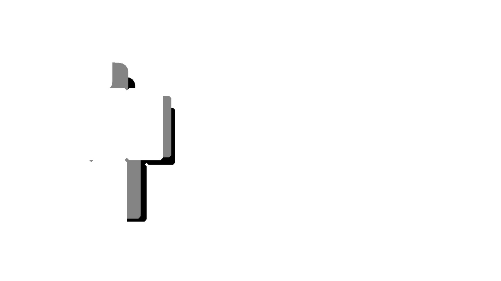

<a id="readme-top"></a>

<div align="center">
  <a href="https://github.com/Paryx-games/roblox-manager">
    
  </a>

  <h3 align="center">Roblox Manager</h3>

  <p align="center">
    A lightweight multi-account manager using Tauri and Rust, featuring low RAM & CPU usage, easy-to-navigate UI and tons of features.
    <br />
    <a href="https://roblox-manager.gitbook.io/docs"><strong>Explore the docs »</strong></a>
    <br />
    <br />
    <a href="https://paryx-games.github.io/roblox-manager/">Our Website</a>
    &middot;
    <a href="https://github.com/Paryx-games/roblox-manager/issues/new?template=bug_report.yml">Report Bug</a>
    &middot;
    <a href="https://github.com/Paryx-games/roblox-manager/issues/new?template=feature_request.yml">Request Feature</a>
  </p>

  <p align="center">
    <a href="https://github.com/Paryx-games/roblox-manager/actions/workflows/rust.yml">
      
    </a>
    <a href="https://github.com/Paryx-games/roblox-manager/actions/workflows/release.yml">
      
    </a>
    <a href="https://github.com/Paryx-games/roblox-manager/releases/latest">
      
    </a>
    
    
    
    
    
  </p>
</div>

> [!NOTE]
> This repository is a fork of [gitlab.com/centerepic/robloxmanager](https://gitlab.com/centerepic/robloxmanager).

<details>
  <summary>Table of Contents</summary>
  <ol>
    <li><a href="#about-the-project">About The Project</a></li>
    <li>
      <a href="#download">Download</a>
      <ul>
        <li><a href="#system-requirements">System Requirements</a></li>
      </ul>
    </li>
    <li><a href="#features">Features</a></li>
    <li><a href="#usage">Usage</a></li>
    <li><a href="#credits">Credits</a></li>
    <li><a href="#support">Support</a></li>
    <li>
      <a href="#building-from-source">Building From Source</a>
      <ul>
        <li><a href="#prerequisites">Prerequisites</a></li>
        <li><a href="#build">Build</a></li>
      </ul>
    </li>
    <li><a href="#development-commands">Development Commands</a></li>
    <li><a href="#reporting-issues--requesting-features">Reporting Issues & Requesting Features</a></li>
    <li><a href="#contributing">Contributing</a></li>
    <li><a href="#license">License</a></li>
  </ol>
</details>

## About The Project

A Windows Roblox account manager built with Rust, Tauri and React. Manage multiple Roblox accounts, launch games, inspect running clients, and organise repeat sessions.

This branch contains the Tauri + React v2 interface. The retired egui application is available in Git history; older published releases may still use that interface. The current user guides are maintained in [docs/](docs/README.md) for GitBook.

**[Visit the RM website](https://paryx-games.github.io/roblox-manager/)** for more information, including additional details about features and the project.

> [!WARNING]
> This tool interacts with Roblox authentication cookies and game-launching internals. Use it at your own risk. The multi-instance feature bypasses Roblox's singleton mutex, which may conflict with Hyperion anti-cheat and could carry a ban risk. This project is not affiliated with or endorsed by Roblox Corporation.

> [!NOTE]
> This project is independent and is not affiliated with, endorsed by, or sponsored by Roblox Corporation.

### Built With

- [Rust](https://www.rust-lang.org/)
- [Tauri](https://tauri.app/)
- [React](https://react.dev/)

<p align="right">(<a href="#readme-top">back to top</a>)</p>

## Download

Choose the release track that suits you:

| Release track | Where to find it | What it means |
| --- | --- | --- |
| **Latest prerelease** | [All releases](https://github.com/Paryx-games/roblox-manager/releases) | The newest `-alpha.N`, `-beta.N`, or `-rc.N` tag. These are still prereleases under SemVer. |
| **GitHub's Latest slot** | [Latest release](https://github.com/Paryx-games/roblox-manager/releases/latest) | GitHub's highlighted download. An `-rc.N` release can occupy this slot during final testing. |
| **Latest actual stable** | [v1.16.0](https://github.com/Paryx-games/roblox-manager/releases/tag/v1.16.0) | The newest final version with no prerelease suffix. This is the stable choice until a newer plain `vX.Y.Z` release ships. |

An RC in GitHub's Latest slot is still a release candidate, not the final stable version. See [CHANGELOG.md](CHANGELOG.md) for what's new in each release.

The Tauri release workflow produces two downloads:

- **Installer** - `roblox-manager-vX.Y.Z-windows-x64-setup.exe`. Installs Roblox Manager for the current Windows user, with shortcut and browser-data choices. **Recommended for most users.**
- **Portable executable** - `roblox-manager-vX.Y.Z-windows-x64.exe`. Run it directly without extracting an archive. Microsoft WebView2 Runtime must already be installed.

Setup defaults to `%LOCALAPPDATA%\Roblox Manager`. It embeds a WebView2 bootstrapper that needs internet access if the runtime is missing. Uninstall optionally removes browser sessions/cache and logs while retaining encrypted accounts, settings, presets and Credential Manager keys. See [Installer and uninstall options](docs/getting-started/installer-options.md) for defaults, data paths and upgrading an older **RM** installation.

Release assets include `SHA256SUMS.txt` for both executable files. Compare a download with `Get-FileHash -Algorithm SHA256` when checking its integrity.

> [!TIP]
> **Portable does not mean fully self-contained.** The portable version still writes application data to `%APPDATA%`, `%LOCALAPPDATA%`, and other relevant Windows locations. These files are not stored entirely alongside the executable.
>
> If you stop using the portable version, you may need to remove this application data separately.

No Rust, Node.js, or pnpm installation is required for either option. These are only needed when building Roblox Manager from source.

### System Requirements

- Windows 10 or 11 (64-bit)
- Roblox installed
- Microsoft WebView2 Runtime for the Tauri interface and account browser windows

<p align="right">(<a href="#readme-top">back to top</a>)</p>

## Features

- **Multi-Account Management** - Add, remove, and organize Roblox accounts with cookie-based auth
- **Encrypted Storage** - AES-256-GCM, unlocked automatically via Windows Credential Manager. An optional master password (Argon2id) is available for anyone who wants one
- **Multi-Instance** - Launch multiple Roblox clients simultaneously
- **Bulk Launch** - Launch selected accounts into the same server sequentially
- **Privacy Mode** - Applies the selected local Roblox data cleanup before launch and, optionally, on exit
- **Discord Webhooks** - Sends optional notifications through a protected Discord webhook
- **Auto Window Tiling** - Arranges Roblox windows in a grid after launch
- **Live Presence** - Real-time Online / In Game / In Studio / Offline indicators
- **Instance Tracking** - Inspect exact, inferred and unmatched clients; focus windows and join supported server targets
- **Saved Destinations** - Launch presets and private-server bookmarks
- **Account Tools** - Browser login, bulk import, credential replacement preserving organisation, and metadata CSV export
- **Developer Workspaces** - Group membership tools, inventory comparisons, creation libraries and staged asset uploads

Auto-launching games on startup, custom game arguments, FastFlags and automatic MAC rotation remain unfinished. Their settings are retained, but those behaviours are not applied automatically. Starting the manager with Windows and explicit manual MAC rotation are separate controls.

> [!IMPORTANT]
> RM stores Roblox authentication cookies in encrypted form. Never share your `.ROBLOSECURITY` cookie with anyone, and treat it like a password.
>
> Discord webhook URLs are sensitive bearer credentials. RM keeps them out of `config.json` and stores them in Windows Credential Manager, alongside the device key. Never share a webhook URL publicly; rotate it in Discord if it is exposed.
>
> If you are planning to contribute, please read the [commit guide](CONVENTIONAL_COMMITS.md) and [contributing guide](CONTRIBUTING.md) before opening a pull request. Changes involving cookie handling, encryption, storage, or process control require additional review and should be explicitly mentioned in the PR description.

> [!CAUTION]
> Never include `.ROBLOSECURITY` cookies, authentication tokens, credentials, encryption keys, or other sensitive account data in issues, pull requests, commits, logs, or screenshots. If you discover a security vulnerability, see [SECURITY.md](SECURITY.md) for how to report it privately.

<p align="right">(<a href="#readme-top">back to top</a>)</p>

## Usage

1. **First launch** - A new encrypted store unlocks through Windows Credential Manager. Follow or skip the walkthrough; existing password-mode stores need their master password.
2. **Add accounts** - Open **Accounts > Add account** and log in through the browser, paste a cookie, or use bulk import.
3. **Launch** - Select an account, enter a Place ID, and choose **Launch**. Presets and Private Servers save repeat destinations.
4. **Bulk launch** - Ctrl-click or Shift-click accounts, then use **Bulk launch**. Configure multi-instance before running several clients.
5. **Instances** - Inspect running clients, focus windows, arrange them, or join a matched server.
6. **Settings** - Save launch, privacy, display, storage and integration preferences. Developer options expose Inventories and Asset Manager.

Use **Refresh accounts** to validate every account or **Revalidate account** for one. Replace a credential while its account remains in the list to preserve alias, group, pin and order. Removing it first deletes that organisation metadata. See [Manage accounts](docs/guides/manage-accounts.md).

> [!CAUTION]
> Multi-instance and privacy features interact with Roblox's local processes and files. Roblox updates may change or break these behaviours, so do not assume that a feature will continue working indefinitely.

<p align="right">(<a href="#readme-top">back to top</a>)</p>

## Credits

- [RobloxManager](https://gitlab.com/centerepic/robloxmanager) by [centerepic](https://gitlab.com/centerepic) - The modern version of RobloxAccountManager that this repository was forked from
- [RobloxAccountManager](https://github.com/ic3w0lf22/Roblox-Account-Manager) by [ic3w0lf22](https://github.com/ic3w0lf22) - The original Roblox Account Manager that served as the primary reference for this project
- [Lucide Icons](https://lucide.dev/icons/) - The icon pack used for icons throughout the app. Licensed under the [ISC License](https://github.com/lucide-icons/lucide/blob/main/LICENSE).

### Contributors

<a href="https://github.com/Paryx-games/roblox-manager/graphs/contributors">
  
</a>

<p align="right">(<a href="#readme-top">back to top</a>)</p>

## Support

If Roblox manager saves time or helps you, you can [buy me a coffee](https://buymeacoffee.com/paryx). This is optional but I would greatly appreciate it 😄

<a href="https://buymeacoffee.com/paryx"></a>

<p align="right">(<a href="#readme-top">back to top</a>)</p>

## Building From Source

### Prerequisites

- [Rust](https://rustup.rs/) (stable)
- [Node.js](https://nodejs.org/) 22+
- [pnpm](https://pnpm.io/) 11+
- Windows 10/11 (required for Win32 APIs)
- Visual Studio Build Tools with Desktop development with C++ and a Windows SDK
- Microsoft WebView2 Runtime

### Build

```powershell
# Clone the repository
git clone https://github.com/Paryx-games/roblox-manager.git
cd roblox-manager
git config core.hooksPath .githooks

# Install frontend dependencies
pnpm --dir ram_ui install --frozen-lockfile

# Build the production Tauri application and installer
pnpm --dir ram_ui tauri build --ci --bundles nsis -- --locked
```

The executable is `target/release/rm_tauri.exe`. The installer is under `target/release/bundle/nsis/`, normally `Roblox Manager_<version>_x64-setup.exe`. A plain `cargo build` does not build and bundle the React frontend; use the Tauri wrapper for distributable builds.

<p align="right">(<a href="#readme-top">back to top</a>)</p>

## Development Commands

Run these commands from the repository root unless noted otherwise.

### Rust workspace

```powershell
# Format all Rust crates
cargo fmt --all

# Check for errors without building
cargo check

# Run all Rust tests
cargo test --workspace

# Run the strict CI lint configuration
cargo clippy --workspace --all-targets -- -D warnings

# Build Rust workspace targets only, not the full Tauri distribution
cargo build --release
```

### Tauri and React UI

The React source and shared tokens live in `ram_ui/frontend/`; Tauri Rust, configuration and installer files live in `ram_ui/src-tauri/`. Run frontend tooling from `ram_ui/` or use `pnpm --dir ram_ui`.

```powershell
# Install frontend dependencies
pnpm --dir ram_ui install

# Start the Vite frontend only
pnpm --dir ram_ui dev

# Start the full Tauri desktop app with hot reload
pnpm --dir ram_ui tauri dev

# Check TypeScript types
pnpm --dir ram_ui typecheck

# Run ESLint and stylelint
pnpm --dir ram_ui lint

# Build the production frontend bundle
pnpm --dir ram_ui build

# Build the optimized Tauri application and installer
pnpm --dir ram_ui tauri build

# Build a standalone debug executable with the frontend embedded
pnpm --dir ram_ui build:debug

# Start Tauri with more detailed, scrubbed diagnostics
$env:RUST_LOG = "debug"
pnpm --dir ram_ui tauri dev
```

The Tauri command wrapper selects the Windows application icon automatically. Development and debug builds use
`assets/logos/Development.ico`; versions containing `-alpha` use `Alpha.ico`; versions containing `-beta` use
`Beta.ico`; and release candidates and stable versions use `Live.ico`. The version is read from the root
`Cargo.toml`.

Installer and uninstaller icons follow the same wrapper selection. The sidebar comes from `assets/branding/LogoThumbVertical.png`, converted to `ram_ui/src-tauri/installer/sidebar.bmp` (164 x 314). Release installer choices are defined in a custom NSIS template; compare it with upstream Tauri when upgrading the CLI.

`tauri dev` requires its Vite server. To run a debug executable independently, build with `build:debug` and use `target/debug/rm_tauri.exe`. Diagnostic output is scrubbed in both the debug console and rotating `%APPDATA%\RM\rm.<date>.log` files. Read the [FAQ](docs/faq.md) before troubleshooting blank windows.

> [!TIP]
> For the quickest local feedback, run `cargo check` and `pnpm --dir ram_ui typecheck` while developing. Use the full validation commands before opening a pull request.

> [!IMPORTANT]
> The v2 branch uses Tauri + React and includes explicitly requested, behavior-preserving extractions into `ram_core/`. Follow the limited core policy in [AGENTS.md](AGENTS.md). Read [DESIGN.md](DESIGN.md) and `ram_ui/frontend/tokens.css` before interface work. Follow [PR_CONVENTIONS.md](PR_CONVENTIONS.md) when opening a PR.

### Pull request validation

Run the same checks used by CI before submitting a change:

```powershell
cargo fmt --all -- --check
cargo check
cargo test --workspace
cargo clippy --workspace --all-targets -- -D warnings
pnpm --dir ram_ui lint
pnpm --dir ram_ui typecheck
```

> [!NOTE]
> Use [Conventional Commits](CONVENTIONAL_COMMITS.md) for commit messages. User-facing changes should also be added to the `Unreleased` section of [CHANGELOG.md](CHANGELOG.md).

> [!WARNING]
> Never include Roblox cookies, authentication tokens, passwords, webhook URLs, account data, logs, or build artifacts in commits, issues, pull requests, or screenshots. Report security vulnerabilities privately through [SECURITY.md](SECURITY.md).

<p align="right">(<a href="#readme-top">back to top</a>)</p>

## Reporting Issues & Requesting Features

Found a bug or have an idea for RM? Here's where it goes:

- **Bug report** - [Open a bug report](https://github.com/Paryx-games/roblox-manager/issues/new?template=bug_report.yml) using the bug template. Include your RM version, OS build, and repro steps.
- **Feature request** - [Open a feature request](https://github.com/Paryx-games/roblox-manager/issues/new?template=feature_request.yml) using the feature template. Explain the use case, not just the feature.
- **Security vulnerability** - Do not open a public issue. Follow the private disclosure process in [SECURITY.md](SECURITY.md) instead.
- **Existing issues** - Check the [open issues](https://github.com/Paryx-games/roblox-manager/issues) first in case it's already tracked.

<p align="right">(<a href="#readme-top">back to top</a>)</p>

## Contributing

Contributions are what make the open source community such an amazing place to learn, inspire, and create. Any contributions you make are **greatly appreciated**.

If you have a suggestion that would make this better, please fork the repo and create a pull request. You can also simply open an issue with the tag "enhancement". Read the [commit guide](CONVENTIONAL_COMMITS.md) and [contributing guide](CONTRIBUTING.md) first - PRs touching cookie handling, encryption, storage, or process control need extra review.

1. Fork the Project
2. Create your Feature Branch (`git checkout -b dev/short-feature-name`)
3. Commit your Changes (`git commit -m 'feat: add some amazing feature'`)
4. Push to the Branch (`git push origin dev/short-feature-name`)
5. Open a Pull Request

<p align="right">(<a href="#readme-top">back to top</a>)</p>

## License

[MIT](LICENSE)

<p align="right">(<a href="#readme-top">back to top</a>)</p>
