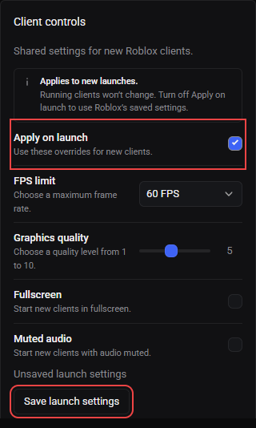

# Client controls

Open **Instances** and find **Client controls**. These are shared defaults for future RM launches, not settings for the selected running client. Selecting a client shows its identity but does not make these overrides account-specific.

*Demo screenshot. The red boxes identify the enable switch and save action; the example has an unsaved edit.*

## Save launch overrides

1. Turn on **Apply on launch**.
2. Choose the desired values below.
3. Choose **Save launch settings**. Saving is unavailable when nothing has changed or a request is pending.
4. Launch new clients through RM to use the saved settings.

| Control | Available values |
| --- | --- |
| FPS limit | 30, 60, 120, 144 or 240 FPS |
| Graphics quality | 1–10 |
| Fullscreen | On or off |
| Muted audio | On or off |

Saving does not update clients already running. An FPS limit is a target ceiling, not a promise that your hardware will achieve that frame rate.

## Disable overrides

Turn off **Apply on launch** and save. RM stops reapplying these overrides; Roblox keeps its last saved local settings. Disabling the switch does not restore an earlier Roblox configuration or change a running client's settings.

These preferences are stored separately from account credentials in `client-launch-settings.json` beside RM's configuration. When enabled, they are applied to Roblox's local `GlobalBasicSettings_13.xml` before launch. Other tools or Roblox may also edit that file.

## Retry a failure

If the controls cannot load, use **Retry**. **Reset launch settings** restores RM's launch preferences to their defaults; it is not an account-store reset. If applying preferences fails before launch, correct the reported Roblox settings/file problem before retrying.

For window tiling, launch pacing and custom arguments/FastFlags, see [Settings](settings.md). For process attribution and closing clients, see [Running instances](instances.md).
