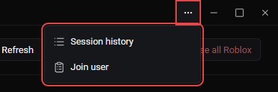

# Session history

Session history is available in v2.2.0 builds and later. It records activity RM observes while the manager is running and the account store is unlocked.

## Open and resize the panel

Open **App actions** (the three-dot button in the title bar), then choose **Session history**. The panel stays open when you switch workspaces. Drag its left edge to resize it, or focus the separator and use arrow keys, Home or End.

*Screenshot from the v2.2.0 demo build. Red outlines identify the menu button and its actions.*

## Understand what is recorded

Events include observed joins, departures, game/server changes, online/offline/Studio changes and moderation changes. The first successful presence check establishes a baseline; it is not recorded as a new join. Network failures do not count as going offline.

Presence is sampled, so brief sessions between checks may be missed. Moderation is recorded when account validation detects it. This is an activity record, not a complete Roblox audit log.

## Choose how long to keep history

| Keep history | Effect |
| --- | --- |
| Until app closes | Keeps events in memory. Starts empty after RM exits and restarts. |
| Save to file | Keeps the latest 10,000 events in `session-history.json` beside `config.json`, across restarts. |

Switching back to memory stops writing but leaves previously saved files on disk. Closing the main window may leave RM running in the tray; use the tray exit action to finish the session.

Saved history is readable activity metadata, not encrypted credentials. Consider who can access your Windows data folder.

## Filter, export or clear

Use **Accounts** to select the accounts to display. **All accounts** selects every available account; choosing it again clears that selection. Choose CSV or JSON, then **Export**. Export uses the current account filter and reports the exported event count.

Exports contain user IDs, observed times, event types, locations and available Place/Job IDs. They contain no credentials or account names, but can still reveal account activity. Review exports before sharing them.

**Clear** asks for confirmation, then clears memory, the saved JSON file and backup, and legacy encrypted history files. This is different from switching to memory-only retention.

## Recovery and older builds

Older encrypted `session-history.dat` files migrate after unlock. Their primary and backup remain for recovery until history is explicitly cleared. Failed migrations preserve the source and can be retried. An unreadable history file is preserved; use **Retry** before considering **Clear**.

Earlier builds that only read encrypted history do not read the new JSON file. Downgrading to them may show older activity. History migration does not change account encryption or the temporary-follow cleanup journal.
